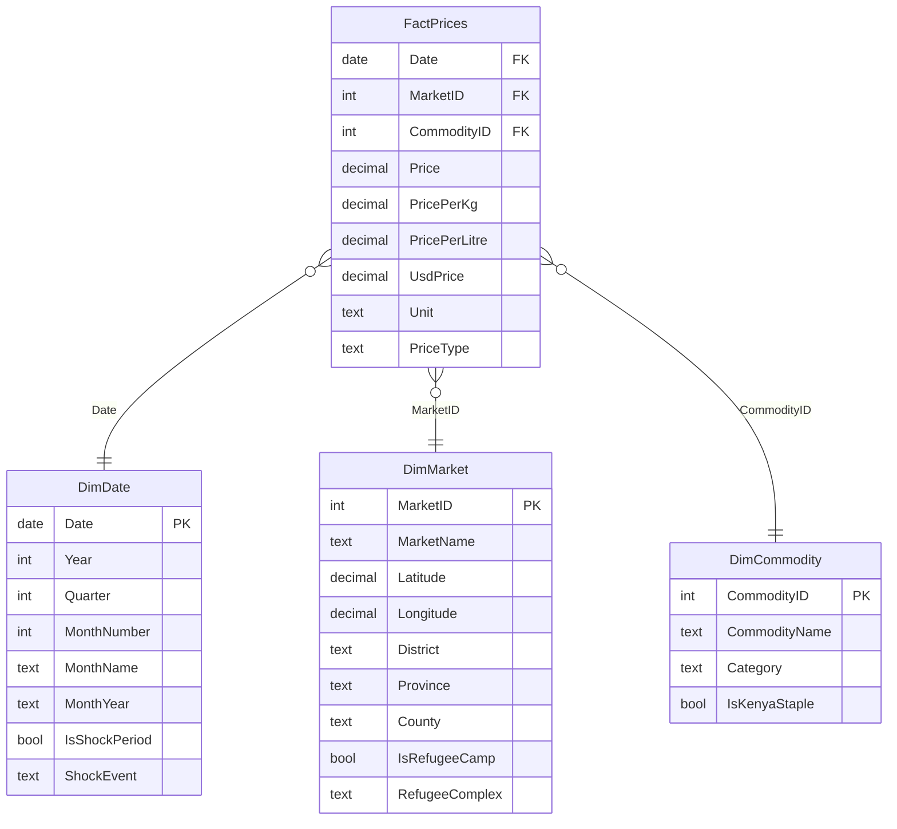

# Star Schema Design — Kenya Food Prices Dashboard

## Why Star Schema (over Snowflake)

Power BI's VertiPaq engine is optimized for star schemas. We get faster queries, simpler DAX (single-hop filter context), and easier maintenance. The minor cost is some denormalized redundancy in dimension tables — negligible at our scale (226 rows in the largest dimension).

## The Model

## Tables

### FactPrices (~12,549 rows)
Granularity: one row per (date × market × commodity × unit × pricetype)
After filtering `priceflag = "actual"`.

| Column | Type | Role |
|---|---|---|
| Date | Date | FK → DimDate |
| MarketID | Integer | FK → DimMarket |
| CommodityID | Integer | FK → DimCommodity |
| Price | Decimal | KES in original unit |
| PricePerKg | Decimal | Computed: price ÷ unit_kg_factor |
| PricePerLitre | Decimal | Computed for litre-based commodities |
| UsdPrice | Decimal | USD cross-reference |
| Unit | Text | Degenerate dim — kept for traceability |
| PriceType | Text | Retail / Wholesale |

### DimDate (~7,670 rows)
Generated calendar table marked as Date Table in Power BI.

| Column | Type | Notes |
|---|---|---|
| Date | Date | Primary key |
| Year | Integer | |
| Quarter | Integer | |
| MonthNumber | Integer | Sort key for MonthName |
| MonthName | Text | |
| MonthYear | Text | "Jan 2024" — for axis labels |
| IsShockPeriod | Boolean | |
| ShockEvent | Text | "2011 HoA Drought", "2020 COVID", "2022 Fuel Shock", etc. |

### DimMarket (~226 rows)
Denormalized geography — all spatial attributes in one table.

| Column | Type | Notes |
|---|---|---|
| MarketID | Integer | Primary key |
| MarketName | Text | |
| Latitude | Decimal | For map visuals |
| Longitude | Decimal | |
| District | Text | admin2 |
| Province | Text | admin1 (legacy) |
| County | Text | Modern post-2013 county (added by lookup) |
| IsRefugeeCamp | Boolean | |
| RefugeeComplex | Text | Kakuma / Dadaab / Kalobeyei / null |

### DimCommodity (~51 rows)
Category folded in as attribute — star choice over snowflake.

| Column | Type | Notes |
|---|---|---|
| CommodityID | Integer | Primary key |
| CommodityName | Text | |
| Category | Text | |
| IsKenyaStaple | Boolean | True for ~10 commodities in the basic Kenyan food basket |

## Relationships

| From | To | Cardinality | Direction | Key |
|---|---|---|---|---|
| DimDate | FactPrices | 1 : many | Single | Date |
| DimMarket | FactPrices | 1 : many | Single | MarketID |
| DimCommodity | FactPrices | 1 : many | Single | CommodityID |

## Hierarchies (defined inside dimensions)

**DimDate Hierarchy:** Year → Quarter → MonthYear → Date
**DimMarket Geography Hierarchy:** Province → County → District → MarketName
**DimCommodity Hierarchy:** Category → CommodityName

## Build Order in Power BI

1. Load `wfp_food_prices_ken.csv` and apply Power Query cleaning steps
2. Create `DimDate` via the M-code calendar generator
3. Reference cleaned Prices query to derive `DimMarket` and `DimCommodity` (distinct rows + attributes)
4. Build the `Counties` lookup table (manual mapping) and merge into DimMarket
5. Strip dimension columns from FactPrices, leaving only keys + measures
6. Define the three relationships in Model view
7. Hide foreign keys from report view (best practice — surface only descriptive columns)
8. Mark DimDate as the Date Table
