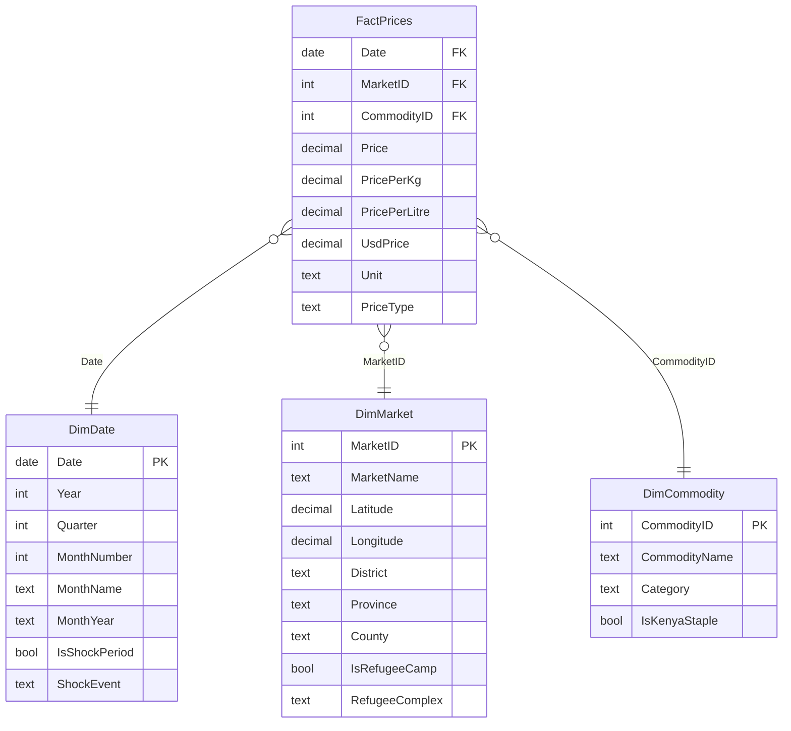

# Kenya Food Prices Dashboard

> *Twenty years of WFP retail food price data across 226 Kenyan markets, transformed into a Power BI decision-support tool for policymakers, humanitarian organizations, and food security analysts.*

[](https://powerbi.microsoft.com/)
[](https://data.humdata.org/dataset/wfp-food-prices-for-kenya)
[](LICENSE)
[]()

---

## Project Overview

This repository contains a Power BI dashboard and supporting documentation for analyzing twenty years of retail food price data across Kenya. Built using publicly available WFP (World Food Programme) data, the project aggregates 19,005 raw price observations from 226 markets across 25 Kenyan counties to surface the country's food affordability patterns — and the regressive cost burden hidden inside national averages.

**The dashboard reveals four major findings:**

1. **2008 was Kenya's worst food inflation year (45% YoY)** — far worse than 2022, but largely forgotten in policy memory
2. **Kenya's poorest counties pay the highest food prices** — Wajir, Mandera, Turkana, Marsabit top the list; Nairobi doesn't appear in the top 10
3. **Food prices have roughly quadrupled in 20 years**, with half the increase concentrated in the last four years
4. **Refugee camp markets are heavily monitored** and bear their own distinctive price patterns

---

## Goal

Kenyan food price decisions are too often made on national averages that mask large county-level and market-level disparities. The National Drought Management Authority, county governments, WFP, food security NGOs, and journalists all need a granular, longitudinal view of how food prices have actually behaved across Kenya — but no such tool existed as a publicly accessible product.

This project closes that gap. The deliverable is an interactive Power BI dashboard built on a clean star schema data model, with 35+ DAX measures supporting time intelligence, regional disparity analysis, and refugee camp comparisons.

---

## Features

- **Interactive Power BI dashboard** with year and county slicers that filter every visual
- **20-year price trend** via a Rolling 12-Month Average measure with shock period overlays
- **Geographic visualization** — Kenya map with bubbles sized by average price across 226 markets
- **County leaderboard** — Top 10 most expensive counties (ASAL counties dominate)
- **Refugee camp segmentation** — 15 markets across Kakuma, Dadaab, and Kalobeyei flagged for separate analysis
- **Six known shock periods flagged** in DimDate: 2008 post-election, 2011 Horn of Africa drought, 2017 maize crisis, 2020 COVID, 2022 fuel/fertilizer shock, 2022–23 ASAL drought
- **35+ DAX measures** demonstrating CALCULATE, time intelligence, regional disparity, and food basket calculations

---

## Data

### Primary Source

**WFP Kenya Food Prices** — published on [Humanitarian Data Exchange (HDX)](https://data.humdata.org/dataset/wfp-food-prices-for-kenya), maintained by the World Food Programme.

| Attribute | Value |
|---|---|
| Time period | 15 January 2006 — 15 March 2026 |
| Total raw records | 19,005 |
| Records after cleaning | 12,588 (filtered to verified market observations) |
| Markets | 226 |
| Counties (modern, post-2013) | 25 of 47 |
| Commodities | 45 across 8 categories |
| Currency | Kenyan Shillings (KES) + USD cross-reference |
| Update frequency | Monthly |
| File size | 2.4 MB |

### Data Sourcing Strategy

This project uses the **Public Open Data Portal** approach (per the project guide) — sourcing the dataset from HDX, the standard humanitarian data platform used by WFP, FAO, FEWS NET, and major NGOs. Citing HDX (rather than a Kaggle mirror) signals data literacy and ensures the latest available data is used.

### Data Limitations

- **Not nationally representative.** WFP monitoring concentrates on food-insecure regions. 22 of Kenya's 47 counties have no observations (notably most of Western Province, parts of Central, and the agricultural breadbasket).
- **Heavy ASAL bias.** Turkana (57 markets), Garissa (21), Samburu (20), and Marsabit (19) dominate the dataset.
- **Uneven density across years.** 2006–2020 averaged ~315 records/year; 2021 onwards has 3,000+/year due to expanded monitoring.
- **One market missing coordinates.** Hola (Tana River) has null lat/long; excluded from map visuals.

See [`Docs/data_quality_report.md`](Docs/data_quality_report.md) for the full data profile.

---

## Usage

### Prerequisites

- **Power BI Desktop** (free download from [microsoft.com/power-bi](https://powerbi.microsoft.com/desktop/))
- A Microsoft account (any free account works for sign-in)

### Run the Dashboard

1. Clone or download this repository
2. Open `Kenya-Food-Prices.pbix` in Power BI Desktop
3. Click **Refresh** in the Home ribbon to pull in the data from `Data/wfp_food_prices_ken.csv`
4. Navigate to the **Executive Overview** page
5. Use the Year and County slicers to explore different time periods and regions

### Interact with the Dashboard

- **Year slicer (top right):** filter all visuals to a specific year. Try 2008, 2011, 2022 to see crisis years.
- **County slicer:** filter to a specific county. Try Turkana, Mandera, or Marsabit.
- **Click any bubble on the map:** cross-filters all other visuals to that market.
- **Click a county bar:** drills the rest of the dashboard into that county's data.

---

## Project Structure

```
Kenya-Food-Prices-Capstone/
├── README.md                              # You are here
├── LICENSE                                # MIT
├── Kenya-Food-Prices.pbix                 # Main Power BI file
│
├── Data/
│   ├── wfp_food_prices_ken.csv           # Raw WFP Kenya price data (source)
│   ├── counties_bridge.csv                # Markets → modern counties + refugee flags
│   ├── FactPrices.csv                     # Reference: cleaned fact table
│   ├── DimDate.csv                        # Reference: date dimension
│   ├── DimMarket.csv                      # Reference: market dimension
│   └── DimCommodity.csv                   # Reference: commodity dimension
│
├── Docs/
│   ├── data_quality_report.md             # Quality assessment + cleaning plan
│   ├── star_schema_design.md              # Data model design + ER diagram
│   ├── dax_measures_library.md            # All 35+ DAX measures
│   ├── dashboard_wireframes.md            # 5-page dashboard layout spec
│   ├── counties_bridge_documentation.md   # Bridge table methodology
│   └── reference_csvs_documentation.md    # How to use reference files
│
├── theme/
│   └── kenya_food_prices_theme.json       # Power BI theme (brand colors)
│
└── article/
    └── medium_article.md                  # Published Medium article (draft)
```

---

## Technical Details

### Architecture

This project follows a **star schema** data model — chosen over snowflake for compatibility with Power BI's VertiPaq engine, simpler DAX filter context, and cleaner maintenance.



### Tools and Technologies

- **Power BI Desktop** — modelling, transformations, and dashboard
- **Power Query (M language)** — data cleaning and unit normalization
- **DAX** — analytical measures
- **Python (pandas)** — pre-flight data profiling and reference CSV generation

### Key Technical Decisions

**1. Filter to `priceflag = "actual"` only.** The raw dataset includes 33% computed aggregate rows that would inflate counts and distort averages. Filtering to actual market observations drops the row count from 19,005 to 12,588.

**2. Unit normalization.** Prices in the source data come in 13 different units (KG, 90 KG, 50 KG, 200 G, L, 500 ML, etc.). I built a conditional `UnitKgFactor` column and computed `PricePerKg = price / UnitKgFactor` for cross-market comparability.

**3. Modern county mapping.** WFP's `admin1` uses Kenya's pre-2013 8-province system. I built a Counties bridge table mapping each market to its modern post-2013 county, plus refugee complex flags.

**4. Star schema with degenerate dimensions.** Unit and PriceType are kept as fact-table columns rather than separate dimension tables, since they have low cardinality (13 and 2 distinct values respectively) and are not used for hierarchical filtering.

### Sample DAX Measures

```dax
Avg Price Per Kg = AVERAGE(FactPrices[PricePerKg])

YoY Price Change % = 
DIVIDE(
    [Avg Price Per Kg] - 
    CALCULATE([Avg Price Per Kg], SAMEPERIODLASTYEAR(DimDate[Date])),
    CALCULATE([Avg Price Per Kg], SAMEPERIODLASTYEAR(DimDate[Date]))
)

Rolling 12M Avg Price Per Kg = 
CALCULATE(
    [Avg Price Per Kg],
    DATESINPERIOD(DimDate[Date], LASTDATE(DimDate[Date]), -12, MONTH)
)

County Premium % = 
VAR County = [Avg Price Per Kg]
VAR National = CALCULATE([Avg Price Per Kg], ALL(DimMarket))
RETURN DIVIDE(County - National, National)

Refugee Camp Premium % = 
VAR Camp = CALCULATE([Avg Price Per Kg], DimMarket[IsRefugeeCamp] = TRUE)
VAR NonCamp = CALCULATE([Avg Price Per Kg], DimMarket[IsRefugeeCamp] = FALSE)
RETURN DIVIDE(Camp - NonCamp, NonCamp)
```

The full library of 35+ measures is documented in [`Docs/dax_measures_library.md`](Docs/dax_measures_library.md).

---

## Results & Insights

### Headline Findings

| Insight | Evidence |
|---|---|
| 2008 was Kenya's worst food inflation year | 45% YoY price increase — nearly 3× the 2022 fuel/fertilizer crisis |
| Poorest counties pay the highest food prices | Top 10 dominated by ASAL counties; Nairobi absent |
| Prices have quadrupled in 20 years | KES 25/kg (2006) → KES ~110/kg (2025) |
| Half of total inflation hit in last 4 years | Sharp acceleration post-2020 from compounding shocks |

### Top 10 Most Expensive Counties (avg price per kg, all years)

1. Wajir
2. Isiolo
3. Samburu
4. Turkana
5. Tana River
6. Taita-Taveta
7. Garissa
8. Meru
9. Mandera
10. Marsabit

### Recommended Use Cases

- **County governments:** allocate food subsidy budgets toward counties paying the highest prices, not those with the largest populations
- **NDMA:** use market-level price monitoring as an early warning signal for compounding food crises (the 2008 staircase pattern was visible by month three)
- **WFP and humanitarian donors:** quantify the refugee camp price premium per commodity for accurate budgeting
- **Researchers and journalists:** use 2008 (not 2022) as the historical worst-case food inflation benchmark

For the full insights narrative, see [`article/medium_article.md`](article/medium_article.md).

---

## Future Work

Planned extensions if time and resources permit:

- **Integrate KNBS household budget survey data** to model per-household monthly food cost over time
- **Add rainfall and drought severity data** from FEWS NET to test correlations with price spikes
- **Build a public-facing web version** using Power BI Service or an embedded dashboard on a static site
- **Extend the dashboard to all 5 wireframed pages** — Geographic Disparity, Commodity Trends, Shock Period Analysis, Refugee Camp Lens
- **Quantify the refugee camp premium** per commodity, with statistical significance testing

---

## Contact

**Author:** Jacinta Kamemba
**Email:** jacintamaiyo@gmail.com

For questions, suggestions, or collaboration: open an issue in this repo, or reach out via email.

---

## References & Resources

- [WFP Kenya Food Prices on HDX](https://data.humdata.org/dataset/wfp-food-prices-for-kenya)
- [Kenya National Bureau of Statistics](https://knbs.or.ke)
- [WFP Kenya Country Office](https://www.wfp.org/countries/kenya)
- [FEWS NET Kenya](https://fews.net/east-africa/kenya)
- [Medium Article — Twenty Years of Hunger](article/medium_article.md)

---

## License

MIT License — see [LICENSE](LICENSE) for details. The WFP source data is licensed separately under HDX's open data terms.

---

*Built as part of the Zindua School Data Storytelling Challenge capstone project.*

